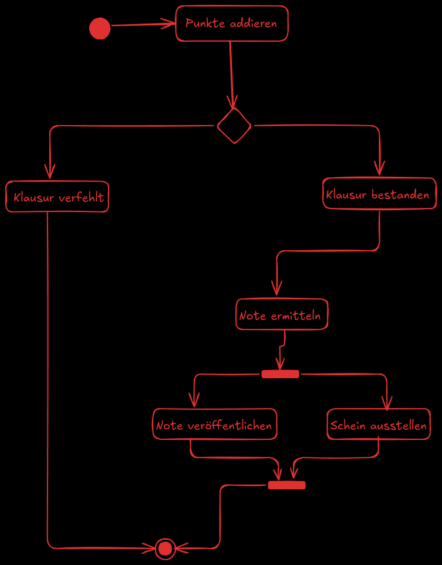
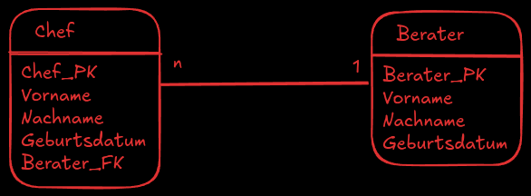
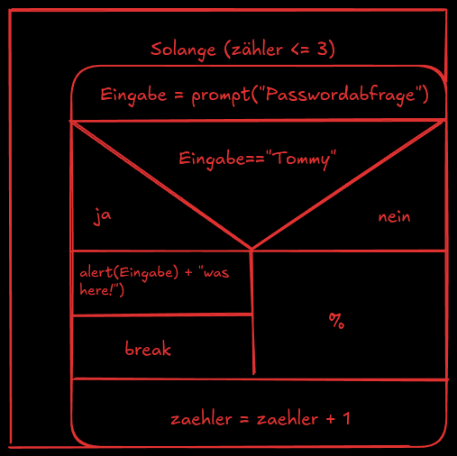
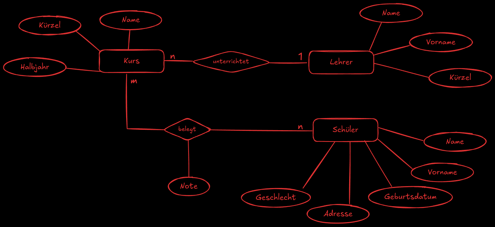
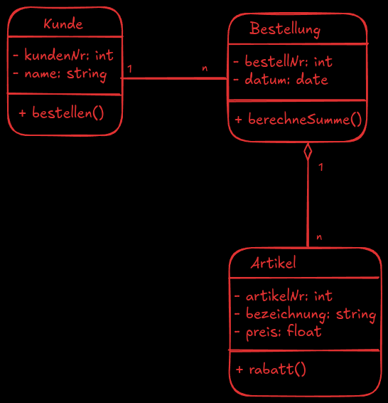

# Entwicklung und Umsetzung von Algorithmen
## Aktivitätsdiagramm



## SQL Commands  

### 1. SELECT – Daten abfragen
```sql
SELECT * FROM kunden;
SELECT name, email FROM kunden WHERE stadt = 'Berlin';
```

### 2. INSERT – Neue Daten einfügen
```sql
INSERT INTO kunden (name, email, stadt) VALUES ('Max Mustermann', 'max@email.de', 'Berlin');
```

### 3. UPDATE – Daten ändern
```sql
UPDATE kunden SET email = 'neu@email.de' WHERE name = 'Max Mustermann';
```

### 4. DELETE – Daten löschen
```sql
DELETE FROM kunden WHERE name = 'Max Mustermann';
```

### 5. CREATE TABLE – Neue Tabelle erstellen
```sql
CREATE TABLE kunden (
	id INT PRIMARY KEY,
	name VARCHAR(100),
	email VARCHAR(100),
	stadt VARCHAR(50)
);
```

### 6. ALTER TABLE – Tabelle ändern
```sql
ALTER TABLE kunden ADD geburtsdatum DATE;
```

### 7. DROP TABLE – Tabelle löschen
```sql
DROP TABLE kunden;
```

### 8. JOIN – Tabellen verbinden
```sql
SELECT kunden.name, bestellungen.datum
FROM kunden
JOIN bestellungen ON kunden.id = bestellungen.kunden_id;
```

## Prozessanalyse 

Die Prozessanalyse ist ein wichtiger Bestandteil der Fachinformatik. Sie dient dazu, Arbeitsabläufe in Unternehmen zu verstehen, Schwachstellen zu erkennen und Verbesserungen vorzuschlagen. Ziel ist es, Prozesse effizienter und fehlerfreier zu gestalten.

**Wichtige Schritte der Prozessanalyse:**
- Prozess identifizieren und abgrenzen: Welcher Ablauf soll betrachtet werden?
- Ist-Zustand aufnehmen: Den aktuellen Ablauf dokumentieren (z.B. mit Diagrammen, Interviews, Beobachtungen).
- Ablaufschritte, Beteiligte und Ressourcen erfassen: Wer macht was, wann und womit?
- Schwachstellen und Engpässe erkennen: Wo treten Fehler, Verzögerungen oder unnötige Aufwände auf?
- Verbesserungsvorschläge erarbeiten: Wie kann der Prozess effizienter, sicherer oder kostengünstiger gestaltet werden?

**Typische Werkzeuge und Methoden:**
- Flussdiagramm / Aktivitätsdiagramm: Visualisierung der Ablaufschritte
- BPMN (Business Process Model and Notation): Standardisierte Modellierung von Geschäftsprozessen
- Interview und Beobachtung: Informationen direkt von den Beteiligten sammeln

**Bedeutung für Fachinformatiker:**
- Prozesse analysieren, um Anforderungen für Software und IT-Systeme zu ermitteln
- Optimierungspotenziale erkennen und digitale Lösungen vorschlagen
- Schnittstellen zwischen Mensch, Maschine und Software verstehen

## Pseudocode 

**Aufgabe:**
Schreibe einen Pseudocode, der eine Liste von Zahlen durchläuft und sowohl die größte als auch die kleinste Zahl sowie deren Positionen in der Liste findet.

**Lösung (Pseudocode):**
```
Eingabe: liste mit Zahlen
Setze größte = erstes Element der liste
Setze kleinste = erstes Element der liste
Setze pos_größte = 0
Setze pos_kleinste = 0

Für i von 0 bis Länge der liste - 1:
	Wenn liste[i] > größte:
		größte = liste[i]
		pos_größte = i
	Wenn liste[i] < kleinste:
		kleinste = liste[i]
		pos_kleinste = i

Ausgabe: größte, pos_größte, kleinste, pos_kleinste
```

**Textbasierte Lösung:**
Gehe die Liste von Zahlen der Reihe nach durch. Merke dir die größte und die kleinste Zahl sowie deren Positionen. Vergleiche jedes Element mit der aktuellen größten und kleinsten Zahl. Wenn ein Element größer ist als die bisher größte Zahl, aktualisiere die größte Zahl und ihre Position. Wenn ein Element kleiner ist als die bisher kleinste Zahl, aktualisiere die kleinste Zahl und ihre Position. Am Ende gib die größte und die kleinste Zahl mit ihren Positionen aus.

## Relationales Datenmodell

Das relationale Datenmodell ist die Grundlage für die meisten modernen Datenbanksysteme (z.B. MySQL, PostgreSQL, Oracle). Es organisiert Daten in Tabellen (Relationen), die miteinander in Beziehung stehen.

**Wichtige Begriffe:**
- **Tabelle (Relation):** Sammlung von Daten mit gleicher Struktur
- **Zeile (Tupel):** Ein Datensatz in der Tabelle
- **Spalte (Attribut):** Ein Datenfeld, z.B. Name, Preis
- **Primärschlüssel:** Eindeutige Kennung für jeden Datensatz
- **Fremdschlüssel:** Verweis auf einen Primärschlüssel in einer anderen Tabelle

**Vorteile des relationalen Datenmodells:**
- Einfache Struktur und klare Beziehungen
- Datenintegrität durch Schlüssel
- Flexible Abfragen mit SQL



## Struktogramm 



# Planen eines Softwareproduktes

## Änderbarkeit 

Änderbarkeit beschreibt, wie einfach und flexibel ein Softwareprodukt oder Datenmodell an neue Anforderungen, Fehlerbehebungen oder Erweiterungen angepasst werden kann.

**Wichtige Aspekte der Änderbarkeit:**
- Klare und modulare Struktur des Codes oder Datenmodells
- Gute Dokumentation und verständliche Benennung
- Verwendung von Standards und Schnittstellen
- Trennung von Daten und Logik
- Einsatz von Versionierung und Änderungsverfolgung

**Vorteile:**
- Schnellere Anpassung an neue Anforderungen
- Weniger Fehler bei Änderungen
- Geringerer Wartungsaufwand

In relationalen Datenmodellen bedeutet Änderbarkeit z.B., dass Tabellen, Beziehungen und Attribute leicht hinzugefügt, geändert oder entfernt werden können, ohne die Integrität der Daten zu gefährden.

## Barrierefreiheit 

Barrierefreiheit bedeutet, dass Software, Webseiten und IT-Systeme so gestaltet werden, dass sie von allen Menschen unabhängig von körperlichen oder technischen Einschränkungen genutzt werden können.

**Wichtige Aspekte der Barrierefreiheit:**
- Klare und verständliche Benutzeroberflächen
- Unterstützung von Screenreadern und alternativen Eingabemethoden
- Gute Kontraste und Schriftgrößen
- Tastaturbedienbarkeit
- Alternativtexte für Bilder und Grafiken
- Verzicht auf ausschließlich visuelle oder akustische Informationen

**Vorteile:**
- Zugang für Menschen mit Behinderungen
- Einhaltung gesetzlicher Vorgaben (z.B. BITV, WCAG)
- Verbesserte Usability für alle Nutzer

Barrierefreiheit ist ein wichtiger Qualitätsaspekt bei der Entwicklung von Software und Webseiten und sollte von Anfang an berücksichtigt werden.

## Black-Box-Test

Der Black-Box-Test ist eine Testmethode in der Softwareentwicklung, bei der die interne Funktionsweise des Systems nicht betrachtet wird. Stattdessen werden nur die Eingaben und die Ausgaben geprüft.

**Merkmale:**
- Tester kennt den Quellcode nicht
- Test basiert auf Anforderungen und Spezifikationen
- Fokus liegt auf Funktionalität, nicht auf Implementierung

**Vorgehen:**
- Testfälle werden aus den Anforderungen abgeleitet
- Verschiedene Eingaben werden getestet, um zu prüfen, ob die erwarteten Ausgaben geliefert werden

**Vorteile:**
- Unabhängig von der Implementierung
- Findet Fehler in der Funktionalität und Bedienung

**Beispiele:**
- Prüfung, ob ein Login mit korrekten und falschen Daten funktioniert
- Überprüfung von Eingabefeldern auf erlaubte und unerlaubte Werte

## Code Reviews 

Code Reviews sind systematische Überprüfungen des Quellcodes durch andere Entwickler. Ziel ist es, Fehler, Schwachstellen und Verbesserungsmöglichkeiten frühzeitig zu erkennen und die Codequalität zu erhöhen. Sie fördern den Wissensaustausch im Team und helfen, Best Practices einzuhalten.
## Compiler 

Ein Compiler ist ein Programm, das Quellcode in Maschinensprache übersetzt, damit der Computer ihn ausführen kann. Im Gegensatz zum Interpreter wird der gesamte Code vor der Ausführung kompiliert. Beispiele: GCC für C/C++, javac für Java.
## Dokumentation

Dokumentation umfasst alle schriftlichen Informationen zu einem Softwareprojekt. Dazu gehören Anleitungen, Kommentare im Code, technische Beschreibungen und Benutzerhandbücher. Gute Dokumentation erleichtert die Wartung, Weiterentwicklung und Nutzung der Software.
## Effizienz

Effizienz beschreibt, wie ressourcenschonend und schnell ein System arbeitet. In der Softwareentwicklung bedeutet das, dass Programme möglichst wenig Speicher und Rechenleistung benötigen und Aufgaben in kurzer Zeit erledigen.
## Endpoint-Security

Endpoint-Security bezeichnet den Schutz von Endgeräten (z.B. PCs, Smartphones) vor Angriffen und Schadsoftware. Dazu gehören Virenschutz, Firewalls, Verschlüsselung und regelmäßige Updates.
## HTTP Statuscodes 

HTTP Statuscodes sind dreistellige Zahlen, die der Webserver als Antwort auf eine Anfrage zurückgibt. Sie zeigen an, ob die Anfrage erfolgreich war, einen Fehler hatte oder weitere Aktionen nötig sind. Beispiele: 200 (OK), 404 (Nicht gefunden), 500 (Serverfehler).
## Interpreter 

Ein Interpreter ist ein Programm, das Quellcode direkt Zeile für Zeile ausführt, ohne ihn vorher in Maschinencode zu übersetzen. Beispiele sind Python- oder JavaScript-Interpreter. Vorteil: Schnelles Testen und einfache Fehlersuche.
## Klassenbibliothek

Eine Klassenbibliothek ist eine Sammlung von vordefinierten Klassen und Funktionen, die Programmierer in ihren Projekten nutzen können. Sie erleichtert die Entwicklung, da viele Standardaufgaben (z.B. Dateioperationen, mathematische Berechnungen) bereits abgedeckt sind. Beispiele: .NET Framework, Java Standard Library.
## Softwarequalität 
Softwarequalität beschreibt, wie gut eine Software die Anforderungen erfüllt und wie zuverlässig, sicher, wartbar und effizient sie ist. Wichtige Kriterien sind Funktionalität, Zuverlässigkeit, Benutzerfreundlichkeit, Effizienz, Änderbarkeit und Portierbarkeit.

## Unit Tests 
Unit Tests sind automatisierte Tests, die einzelne Programmteile (z.B. Funktionen oder Methoden) isoliert auf korrekte Funktion prüfen. Sie helfen, Fehler frühzeitig zu erkennen und die Wartbarkeit des Codes zu verbessern.

## Usability 
Usability bezeichnet die Benutzerfreundlichkeit einer Software. Sie beschreibt, wie einfach und intuitiv ein System zu bedienen ist. Gute Usability sorgt dafür, dass Nutzer ihre Ziele schnell und ohne Fehler erreichen können.

## User Experience
User Experience (UX) umfasst alle Erfahrungen und Eindrücke, die ein Nutzer bei der Interaktion mit einer Software oder Webseite sammelt. Dazu gehören Usability, Design, Emotionen und die gesamte Nutzerreise.

## Versionsverwaltung
Versionsverwaltung ist ein System zur Nachverfolgung und Organisation von Änderungen am Quellcode. Sie ermöglicht es, verschiedene Entwicklungsstände zu speichern, Änderungen rückgängig zu machen und im Team zusammenzuarbeiten (z.B. mit Git).

## White Box Test 
Beim White-Box-Test kennt der Tester die interne Funktionsweise und den Quellcode des Systems. Es werden gezielt einzelne Programmteile und Abläufe getestet, um Fehler in der Logik und Struktur zu finden.

## Zertifikate
Zertifikate sind Nachweise über bestimmte Kenntnisse, Fähigkeiten oder die Einhaltung von Standards. In der IT gibt es Zertifikate für Personen (z.B. Microsoft, Cisco) und für Systeme (z.B. ISO 27001 für Informationssicherheit).

## ER-Modell

Das Entity-Relationship-Modell (ER-Modell) wird verwendet, um die Struktur und Beziehungen von Daten in einem System grafisch darzustellen und zu planen.

**Wofür nutzt man das ER-Modell?**
- Entwurf und Visualisierung von Datenbanken
- Definition von Entitäten (z.B. Kunde, Bestellung) und deren Beziehungen
- Grundlage für die Umsetzung in ein relationales Datenbankschema
- Kommunikation zwischen Entwicklern, Fachexperten und Auftraggebern
- Frühes Erkennen von Anforderungen und Zusammenhängen im Datenmodell



## UML: Use Case Diagramm

Ein Use Case Diagramm (Anwendungsfalldiagramm) wird genutzt, um die wichtigsten Funktionen und Abläufe eines Systems aus Sicht der Benutzer darzustellen.

**Wofür nutzt man ein Use Case Diagramm?**
- Übersichtliche Darstellung der Anforderungen und Funktionen eines Systems
- Zeigt, welche Akteure (z.B. Benutzer, externe Systeme) mit dem System interagieren
- Unterstützt die Kommunikation zwischen Entwicklern, Auftraggebern und Fachexperten
- Grundlage für die weitere Analyse und das Design von Software


## Verschlüsselung 
Verschlüsselung ist ein Verfahren, um Daten so umzuwandeln, dass sie für Unbefugte unlesbar sind. Nur mit dem passenden Schlüssel können die Daten wieder entschlüsselt und gelesen werden.

**Wichtige Aspekte der Verschlüsselung:**
- Schutz von vertraulichen Informationen (z.B. Passwörter, E-Mails, Dateien)
- Einsatz in der Kommunikation (z.B. HTTPS, VPN)
- Symmetrische Verschlüsselung: Sender und Empfänger nutzen denselben Schlüssel (z.B. AES)
- Asymmetrische Verschlüsselung: Es gibt einen öffentlichen und einen privaten Schlüssel (z.B. RSA)

**Vorteile:**
- Erhöhte Datensicherheit
- Schutz vor Datenmissbrauch und Diebstahl
- Einhaltung gesetzlicher Vorgaben (z.B. DSGVO)

## UML Klassendiagramm

Ein UML Klassendiagramm ist ein zentrales Modellierungswerkzeug in der objektorientierten Softwareentwicklung. Es zeigt die Klassen eines Systems, deren Attribute und Methoden sowie die Beziehungen zwischen den Klassen (z.B. Vererbung, Assoziation, Aggregation).

**Wofür nutzt man ein UML Klassendiagramm?**
- Struktur und Aufbau eines Softwaresystems visualisieren
- Beziehungen und Abhängigkeiten zwischen Klassen darstellen
- Grundlage für die Implementierung und Kommunikation im Entwicklungsteam
- Unterstützung bei der Planung und Dokumentation von Softwareprojekten

**Wichtige Beziehungen im UML Klassendiagramm:**
- **Assoziation:** Verknüpfung zwischen zwei Klassen, z.B. Kunde bestellt Bestellung. Kann eine Richtung und Multiplizität haben (z.B. 1:n).
- **Aggregation:** "Ganzes-Teil"-Beziehung, bei der die Teile auch unabhängig existieren können. Beispiel: Bestellung enthält Artikel.
- **Komposition:** Stärkere Form der Aggregation, bei der die Teile nur im Zusammenhang mit dem Ganzen existieren und mit diesem gelöscht werden.
- **Vererbung (Generalisierung):** Eine Klasse erbt Attribute und Methoden von einer anderen Klasse. Beispiel: Mitarbeiter erbt von Person.
- **Abhängigkeit:** Eine Klasse nutzt eine andere Klasse temporär, z.B. als Parameter in einer Methode.(unsicher)
