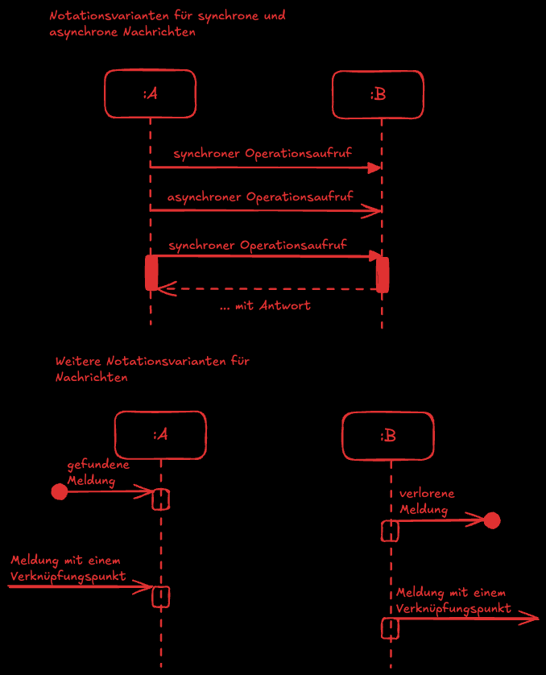

# Entwicklung und Umsetzung von Algorithmen

## Inhaltsverzeichnis 

- [Äquivalenzklassen](#äquivalenzklassen)
- [Code Coverage](#code-coverage)
- [Schreibtischtest](#schreibtischtest)
- [Stored Procedures](#stored-procedures)
- [Trigger](#trigger)
- [Unit Tests](#unit-tests)
- [Aggregation](#aggregation)
- [Anforderungsanalyse](#anforderungsanalyse)
- [Change Management](#change-management)
- [Dokumentenorientierte Datenbank](#dokumentenorientierte-datenbank)
- [Englisch](#englisch)
- [Fremdvergabe](#fremdvergabe)
- [Klassendiagramm](#klassendiagramm)
- [OAuth](#oauth)
- [Observer](#observer)
- [Pseudocode](#pseudocode)
- [Sequenzdiagramm](#sequenzdiagramm)
- [Ticketsystem](#ticketsystem)
- [Vorgehensmodelle](#vorgehensmodelle)
- [Zertifikate](#zertifikate)

## Aktivitätsdiagramm

```bash
cat ./fiae-2021-winter/notes.md
```

## Äquivalenzklassen

**Definition:**  
Äquivalenzklassen sind Gruppen von Eingabewerten, die vom Programm gleich behandelt werden. Sie helfen, die Anzahl der Testfälle zu reduzieren.

**Beispiel:**  
Beim Testen eines Altersfeldes:
- **Gültige Werte:** 0–120
- **Ungültige Werte:** < 0 oder > 120

| Eingabe | Äquivalenzklasse | Erwartetes Ergebnis      |
|---------|------------------|-------------------------|
| 25      | gültig           | akzeptiert              |
| -5      | ungültig         | abgelehnt               |
| 130     | ungültig         | abgelehnt               |

**Vorteile:**  
- Weniger Testaufwand  
- Systematische Abdeckung

**Nachteile:**  
- Fehler außerhalb der Klassen können übersehen werden

**Praxis-Tipp:**  
Grenzwerte (z.B. 0 und 120) immer mit testen!

## Code Coverage 

**Definition:**  
Code Coverage misst, wie viel Prozent des Codes durch Tests abgedeckt sind.

**Beispiel:**  
Ein Test deckt 80% der Codezeilen ab, aber nur 50% der Bedingungen.

**Typische Tools:**  
- JaCoCo (Java)
- Istanbul (JavaScript)
- Coverage.py (Python)

**Vorteile:**  
- Überblick über Testabdeckung
- Hilft, ungetestete Bereiche zu finden

**Nachteile:**  
- Hohe Coverage ≠ fehlerfreier Code

**Praxis-Tipp:**  
Nicht nur auf die Prozentzahl achten – auch sinnvolle Tests für Sonderfälle schreiben!

## SQL Commands 
```bash
cat ./fiae-2021-winter/notes.md
```
## Pseudocode 
```bash
cat ./fiae-2021-winter/notes.md
```
## Relationales Datenmodell
```bash
cat ./fiae-2021-winter/notes.md
```

## Schreibtischtest 

**Definition:**  
Ein Schreibtischtest (Dry Run) ist das gedankliche Durchspielen eines Algorithmus.

**Beispiel:**  
```java
int sum = 0;
for (int i = 1; i <= 3; i++) {
  sum += i;
}
```
| i | sum |
|---|-----|
| 1 | 1   |
| 2 | 3   |
| 3 | 6   |

**Vorteile:**  
- Einfach, keine Software nötig
- Hilft beim Verständnis

**Nachteile:**  
- Bei komplexen Algorithmen schnell unübersichtlich

**Praxis-Tipp:**  
Ideal zum Überprüfen von Pseudocode oder kleinen Programmen vor der Implementierung.

## Stored Procedures 

**Definition:**  
Gespeicherte Programme in der Datenbank, die mit SQL ausgeführt werden.

**Beispiel:**  
```sql
CREATE PROCEDURE RabattBerechnen()
BEGIN
  UPDATE kunden SET rabatt = 10 WHERE umsatz > 1000;
END;
```

**Vorteile:**  
- Schnelle Ausführung
- Wiederverwendbarkeit
- Sicherheit (Logik bleibt auf der DB)

**Nachteile:**  
- Änderungen oft nur mit Datenbankzugriff möglich
- Weniger flexibel als externe Logik

**Praxis-Tipp:**  
Ideal für wiederkehrende Aufgaben und zentrale Geschäftslogik.

## Trigger

**Definition:**  
Automatische Aktionen in der Datenbank bei bestimmten Ereignissen.

**Beispiel:**  
```sql
CREATE TRIGGER update_timestamp
BEFORE UPDATE ON bestellungen
FOR EACH ROW
SET NEW.updated_at = NOW();
```

**Vorteile:**  
- Automatisierung
- Sicherstellung von Regeln

**Nachteile:**  
- Fehlerhafte Trigger schwer zu finden
- Performance kann leiden

**Praxis-Tipp:**  
Trigger gezielt und sparsam einsetzen, um unerwartete Wechselwirkungen zu vermeiden.

## Unit Tests 
```bash
cat ./fiae-2021-winter/notes.md
```

# Planen eines Software Produkts

## Aggregation 
```bash
cat ./fiae-2021-winter/notes.md
```
## Anforderungsanalyse 

**Definition:**  
Systematisches Erfassen und Dokumentieren der Anforderungen an ein System.

**Beispiel:**  
Interview mit Nutzern, um gewünschte Funktionen einer App zu ermitteln.

**Vorteile:**  
- Klare Zieldefinition
- Weniger Missverständnisse
- Bessere Planung

**Nachteile:**  
- Aufwand für Erhebung und Abstimmung
- Anforderungen können sich ändern

**Praxis-Tipp:**  
Anforderungen regelmäßig überprüfen und anpassen!

## Change Management

**Definition:**  
Steuerung und Dokumentation von Änderungen an Systemen oder Prozessen.

**Beispiel:**  
Ein Software-Update wird beantragt, getestet und nach Freigabe eingespielt.

**Vorteile:**  
- Strukturierte Abläufe
- Weniger Fehler
- Bessere Nachvollziehbarkeit

**Nachteile:**  
- Bürokratie, längere Entscheidungswege

**Praxis-Tipp:**  
Alle Stakeholder einbeziehen und Änderungen frühzeitig kommunizieren.

## Dokumentenorientierte Datenbank

**Definition:**  
Speichert Daten als Dokumente (z.B. JSON), nicht als Tabellen.

**Beispiel:**  
```json
{
  "produkt": "Tisch",
  "preis": 99.99,
  "eigenschaften": ["Holz", "weiß"]
}
```
**Bekannte Systeme:** MongoDB, CouchDB

**Vorteile:**  
- Hohe Flexibilität
- Schnelle Entwicklung

**Nachteile:**  
- Komplexere Abfragen
- Weniger strenge Datenintegrität

**Praxis-Tipp:**  
Ideal für Projekte mit variablen Datenstrukturen.

## Englisch

- Englisch: A relational database organizes data into tables, which consist of rows and columns. Each row represents a record, and each column represents a field within the record.
- Deutsch: Eine relationale Datenbank organisiert Daten in Tabellen, die aus Zeilen und Spalten bestehen. Jede Zeile stellt einen Datensatz dar und jede Spalte ein Feld innerhalb des Datensatzes.

**Weitere Begriffe:**
- Table = Tabelle
- Row = Zeile
- Column = Spalte
- Record = Datensatz
- Field = Feld
**Praxis-Tipp:** Viele IT-Fachbegriffe stammen aus dem Englischen und werden auch im Deutschen oft direkt verwendet. Ein gutes Verständnis der englischen Begriffe erleichtert das Arbeiten mit Dokumentationen und internationalen Teams.


## Fremdvergabe

**Definition:**  
Auslagerung von Aufgaben an externe Dienstleister.

**Beispiel:**  
IT-Support wird an ein externes Unternehmen vergeben.

**Vorteile:**  
- Zugang zu Experten
- Kostenersparnis
- Flexibilität

**Nachteile:**  
- Weniger Kontrolle
- Datenschutzrisiken

**Praxis-Tipp:**  
Klare Verträge und regelmäßige Kontrolle sind wichtig!

## Klassendiagramm

```bash
cat ./fiae-2021-winter/notes.md
```
## OAuth

**Definition:**  
Offenes Protokoll für sichere Autorisierung zwischen Diensten.

**Beispiel:**  
Login mit Google oder Facebook.

**Vorteile:**  
- Erhöhte Sicherheit

**Nachteile:**  
- Komplexe Implementierung

**Praxis-Tipp:**  
OAuth wird oft mit OpenID Connect für Authentifizierung kombiniert.

## Observer

**Definition:**  
Entwurfsmuster, bei dem ein Objekt mehrere andere über Änderungen informiert.

**Beispiel:**  
In einer Chat-App werden alle Teilnehmer benachrichtigt, wenn eine neue Nachricht eingeht.

**Vorteile:**  
- Entkopplung von Komponenten

**Nachteile:**  
- Viele Benachrichtigungen möglich

**Praxis-Tipp:**  
Ideal für Event-getriebene Systeme.

## Pseudocode

```bash
cat ./fiae-2021-winter/notes.md
```

## Sequenzdiagramm

**Definition:**  
UML-Diagramm, das den zeitlichen Ablauf von Nachrichten zwischen Objekten zeigt.

**Beispiel:**  
Anmeldeprozess:  
Frontend → Backend → Datenbank → Backend → Frontend



**Vorteile:**  
- Übersichtliche Darstellung komplexer Abläufe

**Nachteile:**  
- Kann bei großen Systemen schnell unübersichtlich werden

**Praxis-Tipp:**  
Hilft, Schnittstellen und Kommunikationswege zu klären.

## Ticketsystem

**Definition:**  
Software zur Verwaltung und Nachverfolgung von Aufgaben oder Problemen.

**Beispiel:**  
IT-Support bearbeitet Störungsmeldungen als Tickets.

**Vorteile:**  
- Strukturierte Bearbeitung
- Bessere Nachvollziehbarkeit

**Nachteile:**  
- Kann unübersichtlich werden

**Praxis-Tipp:**  
Akzeptanz im Team ist wichtig, sonst werden Tickets nicht konsequent gepflegt.

## Vorgehensmodelle

**Vorgehensmodelle** beschreiben strukturierte Abläufe und Methoden für die Planung, Entwicklung und Wartung von Softwareprojekten. Sie helfen, Projekte zu organisieren, Risiken zu minimieren und die Qualität zu sichern.

### Klassische Vorgehensmodelle

#### Wasserfallmodell

- Die Entwicklung erfolgt in klar getrennten Phasen: Anforderungsanalyse → Design → Implementierung → Test → Wartung.
- Jede Phase muss abgeschlossen sein, bevor die nächste beginnt.
- **Vorteil:** Klare Struktur, einfache Planung.
- **Nachteil:** Änderungen sind später schwer umzusetzen.

**Beispiel:**
```text
Anforderungsanalyse → Entwurf → Implementierung → Test → Wartung
```

#### V-Modell

- Erweiterung des Wasserfallmodells mit Fokus auf Qualitätssicherung.
- Jede Entwicklungsphase hat eine zugeordnete Testphase.
- Häufig im öffentlichen Sektor und bei sicherheitskritischen Projekten.

### Agile Vorgehensmodelle

#### Scrum

- Entwicklung in kurzen Zyklen (Sprints, meist 2–4 Wochen).
- Regelmäßige Meetings (z.B. Daily Scrum, Sprint Review).
- Flexibel bei Änderungen, enge Zusammenarbeit im Team.

#### Kanban

- Visualisierung der Aufgaben auf einem Board (z.B. „To Do“, „In Progress“, „Done“).
- Kontinuierlicher Fluss, keine festen Iterationen.
- Gut für Wartung und Support geeignet.

### Weitere Modelle

- **Spiralmodell:** Iteratives Vorgehen mit Fokus auf Risikomanagement.
- **Extreme Programming (XP):** Betonung von Tests, Feedback und kontinuierlicher Verbesserung.

### Vergleich

| Modell         | Planung      | Flexibilität | Eignung für      |
|----------------|-------------|--------------|------------------|
| Wasserfall     | Hoch        | Gering       | Klare Anforderungen |
| V-Modell       | Hoch        | Mittel       | Qualitätssicherung |
| Scrum/Kanban   | Iterativ    | Hoch         | Dynamische Projekte |

**Praxis-Tipp:**  
Die Wahl des Vorgehensmodells hängt von Projektgröße, Team, Anforderungen und Änderungsbereitschaft ab. Oft werden Modelle kombiniert („hybride Modelle“).

## Zertifikate

```bash
cat ./fiae-2021-winter/notes.md
```
