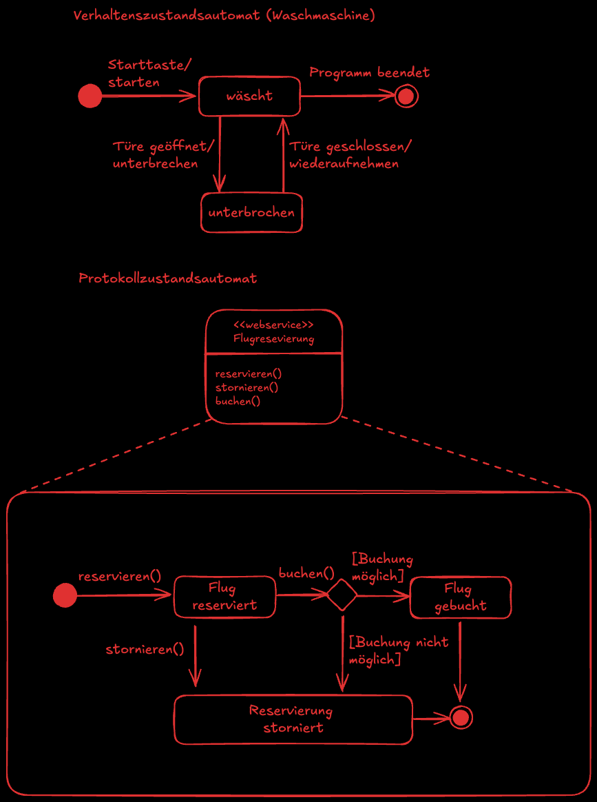

# Entwicklung und Umsetzung von Algorithmen

## Inhaltsverzeichnis

- [Code Coverage](#codecoverage)
- [Datentypen](#datentypen)
- [Fehler finden](#fehlerfinden)
- [Funktionale Programmierung](#funktionaleprogrammierung)
- [Generische Klassen](#generischeklassen)
- [Pseudocode](#pseudocode)
- [Rekursion](#rekursion)
- [Relationales Datenmodell](#relationalesdatenmodell)
- [Schreibtischtest](#schreibtischtest)
- [Sortieralgorithmen](#sortieralgorithmen)
- [Aktivitätsdiagramm](#aktivitätsdiagramm)
- [Anforderungsanalyse](#anforderungsanalyse)
- [CI/CD](#cicd)
- [Dokumentenorientierte Datenbank](#dokumentenorientiertedatenbank)
- [Open-Source](#opensource)
- [Schichtenarchitektur](#schichtenarchitektur)
- [Schwachstellenanalyse](#schwachstellenanalyse)
- [Single-Sign-On](#singlesignon)
- [UI-Design](#uidesign)
- [Verschlüsselung](#verschlüsselung)
- [Vorgehensmodelle](#vorgehensmodelle)
- [XML](#xml)
- [Zertifikate](#zertifikate)
- [Zustandsdiagramm](#zustandsdiagramm)


## Code Coverage

```bash
cat ./fiae-2022-sommer/notes.md
```

## Datentypen
Datentypen bestimmen, welche Art von Werten eine Variable speichern kann und welche Operationen darauf erlaubt sind. Sie sind essenziell, um Speicher effizient zu nutzen und Fehler zu vermeiden.

### Primitive Datentypen

- **Integer (Ganzzahlen):** Speichern ganze Zahlen, z.B. `int`, `short`, `long`.
- **Float/Double (Gleitkommazahlen):** Speichern Zahlen mit Nachkommastellen, z.B. `float`, `double`.
- **Boolean:** Speichert Wahrheitswerte (`true` oder `false`).
- **Char:** Speichert einzelne Zeichen, z.B. `char`.

### Zusammengesetzte Datentypen

- **Arrays:** Sammlung von Elementen gleichen Typs.
- **Structs/Records:** Zusammenfassung verschiedener Datentypen zu einer Einheit.
- **Strings:** Zeichenketten, oft als spezielle Objekte behandelt.

### Abstrakte/Referenzdatentypen

- **Klassen/Objekte:** Benutzerdefinierte Datentypen mit Eigenschaften und Methoden.
- **Listen, Stacks, Queues, Maps:** Dynamische Datenstrukturen.

### Typisierung

- **Statische Typisierung:** Datentypen werden zur Compile-Zeit festgelegt (z.B. Java, C).
- **Dynamische Typisierung:** Datentypen werden zur Laufzeit festgelegt (z.B. Python, JavaScript).

**Beispiel in Java:**
```java
int zahl = 5;
double preis = 19.99;
boolean aktiv = true;
char buchstabe = 'A';
String name = "Max";
```

## Fehler Finden

Fehler (Bugs) sind unerwünschte oder unerwartete Verhaltensweisen in Programmen. Das Finden und Beheben von Fehlern ist ein wichtiger Teil der Softwareentwicklung.

### Arten von Fehlern

- **Syntaxfehler:** Verstöße gegen die Sprachregeln, z.B. fehlendes Semikolon.
- **Logische Fehler:** Das Programm läuft, liefert aber falsche Ergebnisse.
- **Laufzeitfehler:** Fehler, die während der Ausführung auftreten, z.B. Division durch Null.

### Methoden zur Fehlersuche

- **Code-Reviews:** Gemeinsames Durchsehen des Codes im Team.
- **Debugging:** Schrittweises Ausführen des Programms mit einem Debugger, um den Fehler zu lokalisieren.
- **Schreibtischtest (Dry Run):** Manuelles Durchgehen des Codes mit Beispielwerten.
- **Unit-Tests:** Automatisierte Tests für einzelne Programmteile.
- **Logging:** Ausgaben im Code, um den Programmablauf zu verfolgen.

### Beispiel: Logischer Fehler in Java

Im folgenden Beispiel soll die Summe der Zahlen von 1 bis 5 berechnet werden. Durch einen Fehler im Schleifenbereich wird jedoch ein falsches Ergebnis berechnet:

```java
int summe = 0;
for (int i = 1; i < 5; i++) { // Fehler: Schleife läuft nur bis 4
    summe += i;
}
System.out.println(summe); // Ausgabe: 10 (statt 15)
```
**Korrektur:**
```java
int summe = 0;
for (int i = 1; i <= 5; i++) { // Schleife läuft jetzt bis 5
    summe += i;
}
System.out.println(summe); // Ausgabe: 15
```
## Funktionalen Programmierung

Funktionale Programmierung ist ein Programmierparadigma, das Funktionen als zentrale Bausteine verwendet. Im Fokus stehen die Beschreibung von Berechnungen als Auswertung von Ausdrücken und nicht als Folge von Anweisungen.

### Merkmale

- **Pure Funktionen:** Funktionen haben keine Seiteneffekte und liefern bei gleichen Eingaben immer die gleichen Ausgaben.
- **Unveränderlichkeit (Immutability):** Daten werden nicht verändert, sondern es werden neue Werte erzeugt.
- **First-Class Functions:** Funktionen können wie Werte behandelt, übergeben und zurückgegeben werden.
- **Höhere Funktionen:** Funktionen, die andere Funktionen als Argumente nehmen oder zurückgeben.
- **Rekursion:** Schleifen werden oft durch rekursive Funktionsaufrufe ersetzt.

### Vorteile

- Einfacheres Testen und Debuggen durch fehlende Seiteneffekte.
- Bessere Parallelisierbarkeit.
- Kürzerer und oft verständlicherer Code.

### Beispiel in JavaScript

```javascript
// Pure Funktion
function addiere(a, b) {
  return a + b;
}

// Höhere Funktion: map
const zahlen = [1, 2, 3, 4];
const quadrate = zahlen.map(x => x * x); // [1, 4, 9, 16]
```

### Bekannte funktionale Sprachen

- Haskell
- Erlang
- Clojure
- F#
- Scala

Auch viele moderne Sprachen (z.B. JavaScript, Python, Java) unterstützen funktionale Konzepte.

## Generische Klassen

Generische Klassen ermöglichen es, Klassen so zu definieren, dass sie mit verschiedenen Datentypen arbeiten können, ohne für jeden Typ eine eigene Klasse schreiben zu müssen. Sie erhöhen die Wiederverwendbarkeit und Typsicherheit des Codes.

### Vorteile

- **Typsicherheit:** Fehler durch falsche Typen werden schon zur Compile-Zeit erkannt.
- **Wiederverwendbarkeit:** Eine Klasse kann für verschiedene Datentypen verwendet werden.
- **Lesbarkeit:** Der Code bleibt übersichtlich und flexibel.

### Beispiel in Java

```java
// Definition einer generischen Klasse
public class Box<T> {
    private T inhalt;

    public void setInhalt(T inhalt) {
        this.inhalt = inhalt;
    }

    public T getInhalt() {
        return inhalt;
    }
}

// Verwendung
Box<Integer> zahlenBox = new Box<>();
zahlenBox.setInhalt(42);

Box<String> textBox = new Box<>();
textBox.setInhalt("Hallo Welt");
```

Im Beispiel kann die Klasse `Box` beliebige Typen aufnehmen, ohne dass der Code für jeden Typ dupliziert werden muss.

### Generische Klassen in anderen Sprachen

Auch viele andere Sprachen unterstützen Generics, z.B. C# (`List<T>`), C++ (Templates) oder TypeScript (`Array<T>`).

## Pseudocode 

```bash
cat ./fiae-2022-sommer/notes.md
```

## Rekursion 

Rekursion ist eine Technik, bei der sich eine Funktion selbst aufruft, um ein Problem zu lösen. Dabei wird das Problem in kleinere Teilprobleme zerlegt, bis eine Abbruchbedingung (Basisfall) erreicht ist.

### Merkmale

- **Basisfall:** Beendet die Rekursion, verhindert unendliche Aufrufe.
- **Rekursiver Fall:** Die Funktion ruft sich mit einem kleineren Teilproblem selbst auf.

### Vorteile

- Kompakte und elegante Lösungen für Probleme, die sich natürlich in Teilprobleme zerlegen lassen (z.B. Bäume, Listen, mathematische Reihen).

### Nachteile

- Kann zu hohem Speicherverbrauch führen (Stack Overflow), wenn die Rekursion zu tief wird.
- Iterative Lösungen sind manchmal effizienter.

### Beispiel: Fakultät berechnen (Java)

```java
public int fakultaet(int n) {
    if (n <= 1) { // Basisfall
        return 1;
    } else {
        return n * fakultaet(n - 1); // Rekursiver Fall
    }
}
```

**Aufruf:**  
`fakultaet(5)` berechnet `5 * 4 * 3 * 2 * 1 = 120`

### Weitere Beispiele für Rekursion

- Durchlaufen von Verzeichnisstrukturen
- Traversieren von Bäumen (z.B. Binärbaum)
- Fibonacci-Zahlen berechnen
## Relationales Datenmodell

```bash
cat ./fiae-2021-winter/notes.md
```

## Schreibtischtest

```bash
cat ./fiae-2022-sommer/notes.md
```

## Sortieralgorithmen 
Sortieralgorithmen dienen dazu, Elemente in einer bestimmten Reihenfolge anzuordnen, meist aufsteigend oder absteigend. Sie sind ein zentrales Thema in der Informatik, da viele Anwendungen sortierte Daten benötigen.

### Bekannte Sortierverfahren

- **Bubble Sort:** Vergleicht benachbarte Werte und vertauscht sie bei Bedarf. Einfach, aber ineffizient bei großen Datenmengen.
- **Selection Sort:** Sucht das kleinste Element und platziert es an die richtige Stelle. Übersichtlich, aber langsam.
- **Insertion Sort:** Fügt jedes Element an die passende Position im bereits sortierten Teil ein. Besonders gut für kleine oder fast sortierte Listen.
- **Merge Sort:** Teilt die Liste in kleinere Teile, sortiert diese und fügt sie wieder zusammen. Effizient, benötigt aber zusätzlichen Speicher.
- **Quick Sort:** Wählt ein Element als Drehpunkt und ordnet die anderen darum herum. Sehr schnell bei großen Datenmengen, aber nicht immer stabil.

### Beispiel: Insertion Sort in Java

```java
public void insertionSort(int[] daten) {
    for (int i = 1; i < daten.length; i++) {
        int schluessel = daten[i];
        int j = i - 1;
        while (j >= 0 && daten[j] > schluessel) {
            daten[j + 1] = daten[j];
            j = j - 1;
        }
        daten[j + 1] = schluessel;
    }
}
```

### Eigenschaften im Vergleich

- **Stabilität:** Bleiben gleiche Werte in ihrer Reihenfolge? (z.B. Merge Sort: ja, Quick Sort: nein)
- **Speicherbedarf:** Benötigt der Algorithmus zusätzlichen Speicher?
- **Laufzeit:** Wie schnell arbeitet der Algorithmus bei kleinen/großen Datenmengen?

Sortieralgorithmen werden je nach Anwendungsfall und Datenmenge ausgewählt.

## Aktivitätsdiagramm

```bash
cat ./fiae-2021-winter/notes.md
```

## Anforderungsanalyse

```bash
cat ./fiae-2022-sommer/notes.md
```

## CI/CD

**CI/CD** steht für **Continuous Integration** und **Continuous Deployment/Delivery**. Es handelt sich um moderne Praktiken in der Softwareentwicklung, die darauf abzielen, Änderungen am Code schnell, zuverlässig und automatisiert zu integrieren, zu testen und bereitzustellen.

### Continuous Integration (CI)

- Entwickler integrieren regelmäßig (mehrmals täglich) ihren Code in ein zentrales Repository.
- Automatisierte Builds und Tests werden bei jedem Commit ausgeführt.
- Ziel: Fehler frühzeitig erkennen und beheben.

**Beispiel-Ablauf:**
1. Entwickler pusht Code zu GitHub.
2. Ein CI-Server (z.B. Jenkins, GitHub Actions, GitLab CI) startet automatisch Build und Tests.
3. Bei Fehlern wird der Entwickler benachrichtigt.

### Continuous Delivery (CD)

- Erweiterung von CI: Nach erfolgreichen Tests kann die Software jederzeit automatisch ausgeliefert werden.
- Die Auslieferung erfolgt meist auf eine Staging-Umgebung, ein manueller Schritt ist oft noch nötig.

### Continuous Deployment (CD)

- Noch ein Schritt weiter: Nach erfolgreichen Tests wird die Software automatisch in die Produktionsumgebung ausgerollt – ohne manuelles Eingreifen.

### Vorteile

- Schnellere und zuverlässigere Software-Auslieferung
- Weniger Fehler durch automatisierte Tests und Deployments
- Schnellere Rückmeldung für Entwickler

### Beispiel für eine CI/CD-Pipeline (GitHub Actions)

```yaml
name: CI/CD Pipeline

on: [push]

jobs:
  build-and-test:
    runs-on: ubuntu-latest
    steps:
      - uses: actions/checkout@v3
      - name: Setup Java
        uses: actions/setup-java@v3
        with:
          java-version: '17'
      - name: Build with Maven
        run: mvn clean install
      - name: Run Tests
        run: mvn test
```

### Bekannte Tools

- Jenkins
- GitHub Actions
- GitLab CI/CD
- Travis CI
- CircleCI

**Praxis-Tipp:**  
CI/CD sollte früh im Projekt eingeführt werden, um von Anfang an von automatisierten Prozessen zu profitieren.

## Dokumentenorientierte Datenbank

```bash
cat ./fiae-2022-sommer/notes.md
```

## Open-Source

**Open-Source** bezeichnet Software, deren Quellcode öffentlich zugänglich ist und von jedem eingesehen, genutzt, verändert und weiterverbreitet werden darf – meist unter einer speziellen Lizenz.

### Merkmale

- **Quelloffen:** Der Quellcode ist für alle einsehbar.
- **Lizenzierung:** Bekannte Open-Source-Lizenzen sind z.B. MIT, Apache, GPL.
- **Community-getrieben:** Entwicklung und Wartung erfolgen oft gemeinschaftlich durch eine weltweite Entwickler-Community.
- **Transparenz:** Fehler und Sicherheitslücken können schneller entdeckt und behoben werden.

### Vorteile

- Keine Lizenzkosten
- Anpassbarkeit an eigene Bedürfnisse
- Große Auswahl an Software und Bibliotheken
- Förderung von Innovation und Zusammenarbeit

### Nachteile

- Kein Anspruch auf Support (außer bei kommerziellen Anbietern)
- Qualität und Dokumentation können schwanken
- Kompatibilitätsprobleme bei Updates möglich

### Beispiele für bekannte Open-Source-Projekte

- **Linux** (Betriebssystem)
- **Apache HTTP Server** (Webserver)
- **Mozilla Firefox** (Webbrowser)
- **LibreOffice** (Office-Paket)
- **VLC Media Player** (Medienplayer)

**Praxis-Tipp:**  
Vor dem Einsatz von Open-Source-Software immer die Lizenzbedingungen prüfen, besonders bei kommerzieller Nutzung!

## Schichtenarchitektur

Die **Schichtenarchitektur** (engl. Layered Architecture) ist ein Architekturprinzip, bei dem ein Softwaresystem in mehrere, klar voneinander getrennte Schichten (Layers) unterteilt wird. Jede Schicht hat eine bestimmte Aufgabe und kommuniziert nur mit der direkt darunterliegenden oder darüberliegenden Schicht.

### Typische Schichten

1. **Präsentationsschicht (UI/Frontend):**
   - Darstellung der Daten und Interaktion mit dem Benutzer.
   - Beispiel: Webseiten, Desktop-GUI, mobile Apps.

2. **Logikschicht (Business Logic):**
   - Enthält die Geschäftslogik, Regeln und Abläufe der Anwendung.
   - Beispiel: Berechnungen, Validierungen, Steuerung von Prozessen.

3. **Datenzugriffsschicht (Data Access):**
   - Verantwortlich für den Zugriff auf Datenquellen wie Datenbanken oder externe Dienste.
   - Beispiel: SQL-Abfragen, ORM, API-Aufrufe.

4. **Datenhaltungsschicht (Persistence):**
   - Speicherung und Verwaltung der eigentlichen Daten.
   - Beispiel: Datenbanken, Dateisysteme.

### Vorteile

- **Trennung von Verantwortlichkeiten:** Jede Schicht hat eine klar definierte Aufgabe.
- **Wartbarkeit:** Änderungen in einer Schicht wirken sich kaum auf andere aus.
- **Wiederverwendbarkeit:** Schichten können in anderen Projekten wiederverwendet werden.
- **Testbarkeit:** Einzelne Schichten lassen sich leichter isoliert testen.

### Beispiel (vereinfachtes 3-Schichten-Modell)

```text
+---------------------+
| Präsentationsschicht|
|  (z.B. Web-Frontend)|
+----------+----------+
           |
+----------v----------+
|   Logikschicht      |
| (Geschäftslogik)    |
+----------+----------+
           |
+----------v----------+
| Datenzugriffsschicht|
| (z.B. Datenbank)    |
+---------------------+
```

### Praxis-Tipp

- Die Schichtenarchitektur ist besonders für größere Anwendungen geeignet.
- Sie fördert sauberen, modularen Code und erleichtert die Zusammenarbeit im Team.

## Schwachstellenanalyse

Die **Schwachstellenanalyse** ist ein wichtiger Bestandteil der IT-Sicherheit. Ziel ist es, Schwachstellen (Vulnerabilities) in Systemen, Anwendungen oder Prozessen zu identifizieren, zu bewerten und zu beheben, bevor sie von Angreifern ausgenutzt werden können.

### Ablauf einer Schwachstellenanalyse

1. **Informationssammlung:**  
   Erfassen aller relevanten Systeme, Anwendungen und Schnittstellen.

2. **Identifikation von Schwachstellen:**  
   Einsatz von Tools (z.B. Scanner wie Nessus, OpenVAS) oder manuelle Überprüfung, um bekannte Schwachstellen zu finden.

3. **Bewertung der Schwachstellen:**  
   Einschätzung des Risikos (z.B. nach CVSS-Score), Priorisierung nach Kritikalität.

4. **Behebung:**  
   Maßnahmen zur Beseitigung oder Absicherung der Schwachstellen (z.B. Updates, Patches, Konfigurationsänderungen).

5. **Dokumentation und Nachkontrolle:**  
   Festhalten der Ergebnisse und Überprüfung, ob die Schwachstellen erfolgreich behoben wurden.

### Beispiele für Schwachstellen

- Veraltete Software mit bekannten Sicherheitslücken
- Unsichere Passwörter oder Standardpasswörter
- Fehlende Verschlüsselung bei Datenübertragung
- Fehlkonfigurierte Firewalls oder Zugriffsrechte

### Tools zur Schwachstellenanalyse

- **Nessus**
- **OpenVAS**
- **Burp Suite** (für Webanwendungen)
- **OWASP ZAP**

### Vorteile

- Erhöht die Sicherheit des Systems
- Reduziert das Risiko von Angriffen und Datenverlust
- Erfüllt Compliance-Anforderungen

### Praxis-Tipp

Schwachstellenanalysen sollten regelmäßig und nach jeder größeren Änderung durchgeführt werden. Automatisierte Tools helfen, aber eine manuelle Überprüfung ist oft zusätzlich sinnvoll.

## Single-Sign-On (SSO)

**Single-Sign-On (SSO)** ist ein Authentifizierungsverfahren, bei dem sich ein Benutzer einmal anmeldet und danach auf mehrere unabhängige Anwendungen oder Dienste zugreifen kann, ohne sich erneut anmelden zu müssen.

### Funktionsweise

- Der Benutzer meldet sich bei einem zentralen Authentifizierungsdienst an.
- Nach erfolgreicher Anmeldung erhält der Benutzer ein Token oder eine Session.
- Dieses Token wird von anderen Anwendungen akzeptiert, sodass keine erneute Anmeldung nötig ist.

### Vorteile

- **Komfort:** Nur eine Anmeldung für viele Dienste.
- **Sicherheit:** Zentrale Verwaltung der Zugangsdaten, weniger Passwort-Wiederverwendung.
- **Effizienz:** Weniger Anmeldeprozesse, geringerer Verwaltungsaufwand.

### Nachteile

- **Single Point of Failure:** Fällt der zentrale Dienst aus, sind alle angebundenen Systeme betroffen.
- **Komplexität:** Die Integration verschiedener Systeme kann aufwendig sein.

### Beispiele

- Anmeldung bei Google und Zugriff auf Gmail, Google Drive, YouTube etc.
- Unternehmensnetzwerke mit zentralem Login für verschiedene interne Tools.

### Typische Protokolle

- **SAML** (Security Assertion Markup Language)
- **OAuth** / **OpenID Connect**
- **Kerberos**

**Praxis-Tipp:**  
SSO erhöht den Nutzerkomfort, sollte aber immer mit starken Sicherheitsmaßnahmen (z.B. Zwei-Faktor-Authentifizierung) kombiniert werden.

## UI-Design

**UI-Design** (User Interface Design) beschäftigt sich mit der Gestaltung der Benutzeroberfläche einer Anwendung. Ziel ist es, die Bedienung so einfach, intuitiv und ansprechend wie möglich zu machen.

### Grundprinzipien des UI-Designs

- **Konsistenz:** Gleiche Elemente sollten sich gleich verhalten und aussehen.
- **Übersichtlichkeit:** Die Oberfläche sollte klar strukturiert und nicht überladen sein.
- **Feedback:** Das System gibt dem Nutzer Rückmeldung zu seinen Aktionen (z.B. Ladebalken, Fehlermeldungen).
- **Erreichbarkeit:** Wichtige Funktionen sollten leicht auffindbar sein.
- **Fehlertoleranz:** Fehlerhafte Eingaben sollten erkannt und verständlich erklärt werden.

### Beispiele für UI-Elemente

- Buttons, Eingabefelder, Dropdown-Menüs
- Navigationsleisten
- Dialogfenster und Pop-ups
- Icons und Tooltips

### Best Practices

- **Weniger ist mehr:** Nur die wichtigsten Informationen und Funktionen anzeigen.
- **Klare Beschriftungen:** Buttons und Felder eindeutig benennen.
- **Responsives Design:** Die Oberfläche passt sich an verschiedene Bildschirmgrößen an (z.B. Smartphone, Tablet, Desktop).
- **Barrierefreiheit:** Auch Menschen mit Einschränkungen sollten die Anwendung bedienen können (z.B. durch Screenreader-Unterstützung).

### Beispiel: Login-Formular (HTML)

```html
<form>
  <label for="email">E-Mail:</label>
  <input type="email" id="email" name="email" required>
  <br>
  <label for="password">Passwort:</label>
  <input type="password" id="password" name="password" required>
  <br>
  <button type="submit">Anmelden</button>
</form>
```

**Praxis-Tipp:**  
Vor dem Umsetzen eines UI-Designs lohnt sich das Erstellen von Mockups oder Prototypen, z.B. mit Figma oder Adobe XD.

## Verschlüsselung

```bash
cat ./fiae-2021-winter/notes.md
```

## Vorgehensmodelle

```bash
undone
```

## XML

**XML** ist eine Auszeichnungssprache zur Darstellung hierarchisch strukturierter Daten im Textformat. Sie wird häufig für den Austausch von Daten zwischen verschiedenen Systemen und Anwendungen verwendet.

### Merkmale

- **Selbstbeschreibend:** Daten werden durch Tags (Elemente) strukturiert.
- **Hierarchisch:** Elemente können verschachtelt werden.
- **Plattformunabhängig:** Kann von vielen Programmiersprachen gelesen und geschrieben werden.
- **Erweiterbar:** Eigene Tags können definiert werden.

### Beispiel für eine XML-Datei

```xml
<?xml version="1.0" encoding="UTF-8"?>
<kunden>
  <kunde id="1">
    <name>Max Mustermann</name>
    <email>max@example.com</email>
  </kunde>
  <kunde id="2">
    <name>Erika Musterfrau</name>
    <email>erika@example.com</email>
  </kunde>
</kunden>
```

### Typische Anwendungsgebiete

- Datenaustausch zwischen Systemen (z.B. Webservices, APIs)
- Konfigurationsdateien (z.B. für Anwendungen oder Build-Tools)
- Speicherung von strukturierten Daten

### Vorteile

- Mensch und Maschine können XML lesen.
- Standardisiert und weit verbreitet.
- Unterstützt Validierung durch DTD oder XML Schema.

### Nachteile

- Im Vergleich zu JSON oft umfangreicher und schwerfälliger.
- Verarbeitung kann komplexer sein.

**Praxis-Tipp:**  
Für einfache Datenstrukturen wird heute oft JSON bevorzugt, XML eignet sich aber weiterhin gut für komplexe, strukturierte Daten und wenn Validierung wichtig ist.

## Zertifikate

```bash
cat ./fiae-2021-winter/notes.md
```

## Zustandsdiagramm

Ein **Zustandsdiagramm** (engl. State Diagram) ist ein Diagrammtyp aus der UML (Unified Modeling Language), der das Verhalten eines Systems oder Objekts in Abhängigkeit von seinen Zuständen und den auslösenden Ereignissen beschreibt.

### Merkmale

- Zeigt alle möglichen Zustände eines Objekts oder Systems.
- Stellt dar, wie und wodurch Zustandswechsel (Transitions) ausgelöst werden.
- Wird häufig für die Modellierung von Lebenszyklen, Automaten oder Workflows verwendet.

### Bestandteile

- **Zustände (States):** Rechteckige Kästchen, die einen bestimmten Zustand darstellen (z.B. „offen“, „in Bearbeitung“, „geschlossen“).
- **Übergänge (Transitions):** Pfeile, die den Wechsel von einem Zustand in einen anderen zeigen. Sie werden durch Ereignisse oder Bedingungen ausgelöst.
- **Startzustand:** Markiert durch einen ausgefüllten Kreis.
- **Endzustand:** Markiert durch einen Kreis mit einem Punkt darin.

### Anwendungsgebiete

- Steuerung von Benutzeroberflächen (z.B. Button kann „aktiv“, „inaktiv“, „gedrückt“ sein)
- Ablaufsteuerung in Automaten (z.B. Getränkeautomat)
- Lebenszyklus von Objekten (z.B. Bestellung: „neu“, „bezahlt“, „versendet“, „storniert“)

**Praxis-Tipp:**  
Zustandsdiagramme helfen, komplexe Abläufe übersichtlich darzustellen und Fehler in der Ablaufsteuerung frühzeitig zu erkennen.


