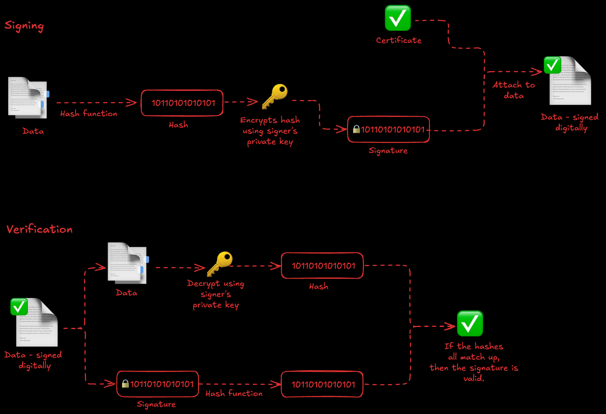

# Entwicklung und Umsetzung von Algorithmen

## Inhaltsverzeichnis

- [Aktivitätsdiagramm](#aktivitätsdiagramm)
- [Code Coverage](#codecoverage)
- [Fehler finden](#fehlerfinden)
- [Pseudocode](#pseudocode)
- [SQL](#sql)

# Planen eines Softwareproduktes

## Inhaltsverzeichnis

- [Anforderungsanalyse](#anforderungsanalyse)
- [Anomalien](#anomalien)
- [Change Management](#changemanagement)
- [Design Patterns](#designpatterns)
- [Digitale Signatur](#digitalesignatur)
- [Klassendiagramm](#klassendiagramm)
- [Kostenarten](#kostenarten)
- [Objektorientierung](#objektorientierung)
- [Polymorphie](#polymorphie)
- [Qualitätsicherung](#qualitätsicherung)
- [Relationales Datenmodell](#relationalesdatenmodell)
- [Risikoanalyse](#risikoanalyse)
- [Softwarequalität](#softwareqialität)
- [Tabellenkalkulation](#tabellenkalkulation)
- [Verschlüsselung](#verschlüsselung)
- [Zustandsdiagramm](#zustandsdiagramm)

## Aktivitätsdiagramm

```bash
cat ./fiae-2021-winter/notes.md
```

## Code Coverage

```bash
cat ./fiae-2022-sommer/notes.md
```

## Fehler finden

```bash
cat ./fiae-2022-winter/notes.md
```

## Pseudocode

```bash
cat ./fiae-2022-sommer/notes.md
```

## SQL 

```bash
cat ./fiae-2021-winter/notes.md
```

---
---

## Anforderungsanalyse

```bash
cat ./fiae-2022-sommer/notes.md
```

## Anomalien 

**Anomalien** treten in Datenbanken auf, wenn die Datenstruktur nicht optimal gestaltet ist – meist durch fehlende Normalisierung. Sie führen zu unerwünschten Nebeneffekten beim Einfügen, Ändern oder Löschen von Daten.

### Arten von Anomalien

1. **Einfügeanomalie (Insert Anomaly):**
   - Es können nicht alle gewünschten Daten eingefügt werden, ohne dass andere (ggf. noch nicht bekannte) Daten ebenfalls eingefügt werden müssen.
   - **Beispiel:** In einer Tabelle „Bestellungen“ mit den Spalten `Kunde`, `Bestellnummer`, `Artikel` kann kein neuer Kunde angelegt werden, ohne dass er eine Bestellung tätigt.

2. **Änderungsanomalie (Update Anomaly):**
   - Eine Änderung an einem Wert muss an mehreren Stellen durchgeführt werden. Wird eine Stelle vergessen, entstehen Inkonsistenzen.
   - **Beispiel:** Die Adresse eines Kunden steht mehrfach in einer Tabelle. Wird sie nur an einer Stelle geändert, sind die Daten widersprüchlich.

3. **Löschanomalie (Delete Anomaly):**
   - Beim Löschen eines Datensatzes gehen auch andere, eigentlich noch benötigte Informationen verloren.
   - **Beispiel:** Wird die letzte Bestellung eines Kunden gelöscht, verschwindet auch der Kunde aus der Datenbank, obwohl seine Daten noch gebraucht werden.

### Ursache

- Anomalien entstehen meist durch Redundanzen und fehlende Trennung von Daten (fehlende Normalisierung).

### Lösung

- **Normalisierung:** Die Daten werden so strukturiert, dass jede Information nur einmal gespeichert wird (z.B. durch Aufteilung in mehrere Tabellen mit Beziehungen).

**Praxis-Tipp:**  
Durch die Anwendung der Normalformen (1NF, 2NF, 3NF) lassen sich Anomalien in relationalen Datenbanken vermeiden.

## Change Management

```bash
cat ./fiae-2022-sommer/notes.md
```

## Design Patterns

**Design Patterns** (Entwurfsmuster) sind bewährte, wiederverwendbare Lösungen für häufig auftretende Probleme in der Softwareentwicklung. Sie helfen, den Code strukturierter, flexibler und wartbarer zu gestalten.

### Vorteile von Design Patterns

- Erleichtern die Kommunikation im Team durch gemeinsame Begriffe
- Fördern sauberen und verständlichen Code
- Lösen typische Entwurfsprobleme effizient und nachvollziehbar

### Kategorien von Design Patterns

1. **Erzeugungsmuster (Creational Patterns):**
   - Regeln, wie Objekte erzeugt werden.
   - **Beispiele:** Singleton, Factory Method, Builder

2. **Strukturmuster (Structural Patterns):**
   - Beschreiben, wie Klassen und Objekte zu größeren Strukturen zusammengesetzt werden.
   - **Beispiele:** Adapter, Decorator, Composite

3. **Verhaltensmuster (Behavioral Patterns):**
   - Regeln die Interaktion und Verantwortlichkeiten zwischen Objekten.
   - **Beispiele:** Observer, Strategy, Command

### Beispiele

#### Singleton (Erzeugungsmuster)
Stellt sicher, dass es von einer Klasse nur ein einziges Objekt gibt.

```java
public class Singleton {
    private static Singleton instance;
    private Singleton() {}
    public static Singleton getInstance() {
        if (instance == null) {
            instance = new Singleton();
        }
        return instance;
    }
}
```

#### Observer (Verhaltensmuster)
Ein Objekt (Subject) informiert mehrere andere (Observer) über Änderungen.

```java
// Java: Observer-Interface und Beispielimplementierung
public interface Observer {
    void update();
}
public class ConcreteObserver implements Observer {
    public void update() {
        System.out.println("Benachrichtigung erhalten!");
    }
}
```

#### Adapter (Strukturmuster)
Ermöglicht die Zusammenarbeit von Klassen mit unterschiedlichen Schnittstellen.

```java
// Beispiel: Ein Adapter passt eine alte Schnittstelle an eine neue an
public class AlteKlasse {
    public void alteMethode() { /* ... */ }
}
public interface NeueSchnittstelle {
    void neueMethode();
}
public class Adapter implements NeueSchnittstelle {
    private AlteKlasse alt;
    public Adapter(AlteKlasse alt) { this.alt = alt; }
    public void neueMethode() { alt.alteMethode(); }
}
```

**Praxis-Tipp:**  
Design Patterns sind keine fertigen Codebausteine, sondern Konzepte. Sie sollten gezielt und nicht zwanghaft eingesetzt werden!

## Digitale Signatur

Eine **digitale Signatur** ist ein kryptografisches Verfahren, das die Authentizität und Integrität digitaler Daten sicherstellt. Sie funktioniert ähnlich wie eine handschriftliche Unterschrift, ist aber technisch viel sicherer und fälschungssicherer.

### Funktionsweise

1. **Erstellung:**  
   - Der Absender erzeugt aus den zu signierenden Daten einen Hashwert (eine Art Fingerabdruck).
   - Dieser Hashwert wird mit dem privaten Schlüssel des Absenders verschlüsselt – das ist die digitale Signatur.

2. **Überprüfung:**  
   - Der Empfänger entschlüsselt die Signatur mit dem öffentlichen Schlüssel des Absenders.
   - Er berechnet selbst den Hashwert der empfangenen Daten.
   - Stimmen beide Hashwerte überein, sind die Daten echt und unverändert.

### Vorteile

- **Authentizität:** Der Absender kann eindeutig identifiziert werden.
- **Integrität:** Die Daten wurden nicht verändert.
- **Nicht-Abstreitbarkeit:** Der Absender kann die Signatur nicht abstreiten (Non-Repudiation).

### Anwendungsbeispiele

- Signieren von E-Mails (z.B. S/MIME)
- Digitale Verträge und Dokumente (z.B. PDF-Signatur)
- Software-Signaturen (z.B. bei Updates)

### Beispiel (vereinfacht)



**Praxis-Tipp:**  
Für digitale Signaturen werden oft Zertifikate von vertrauenswürdigen Stellen (z.B. Trust Center) verwendet.

## Klassendiagramm

```bash
cat ./fiae-2021-winter/notes.md
```

## Kostenarten

**Kostenarten** sind eine grundlegende Kategorie in der Kostenrechnung und dienen dazu, die in einem Unternehmen anfallenden Kosten systematisch zu gliedern. Sie beantworten die Frage: **"Welche Kosten sind angefallen?"**

### Typische Kostenarten

- **Personalkosten:** Löhne, Gehälter, Sozialabgaben
- **Materialkosten:** Rohstoffe, Hilfsstoffe, Betriebsstoffe
- **Abschreibungen:** Wertminderung von Anlagen und Maschinen
- **Fremdleistungskosten:** Kosten für externe Dienstleistungen (z.B. Beratung, Wartung)
- **Betriebskosten:** Energie, Wasser, Miete, Versicherungen
- **Zinskosten:** Zinsen für Kredite

### Beispiel

| Kostenart         | Betrag (€) |
|-------------------|------------|
| Löhne/Gehälter    | 50.000     |
| Materialkosten    | 20.000     |
| Miete             | 5.000      |
| Abschreibungen    | 2.000      |
| Fremdleistungen   | 3.000      |

### Einordnung im Unternehmen

Kostenarten sind die **erste Stufe** der Kostenrechnung. Sie bilden die Basis für die weiteren Stufen:
1. **Kostenartenrechnung:** Welche Kosten sind angefallen?
2. **Kostenstellenrechnung:** Wo sind die Kosten angefallen?
3. **Kostenträgerrechnung:** Wofür sind die Kosten angefallen?

**Praxis-Tipp:**  
Eine saubere Gliederung der Kostenarten erleichtert die spätere Analyse und Kontrolle der Unternehmensausgaben.

## Objektorientierung

**Objektorientierung** ist ein Programmierparadigma, das Software in Objekte gliedert. Jedes Objekt kombiniert Daten (Attribute) und Verhalten (Methoden). Ziel ist es, komplexe Systeme übersichtlich, flexibel und wiederverwendbar zu gestalten.

### Grundbegriffe

- **Klasse:** Bauplan für Objekte. Definiert Attribute und Methoden.
- **Objekt:** Konkrete Instanz einer Klasse.
- **Attribut:** Eigenschaft eines Objekts (z.B. Name, Alter).
- **Methode:** Fähigkeit oder Verhalten eines Objekts (z.B. laufen(), rechnen()).
- **Kapselung:** Daten und Methoden werden in einer Klasse zusammengefasst und vor unberechtigtem Zugriff geschützt.
- **Vererbung:** Eine Klasse kann Eigenschaften und Methoden einer anderen Klasse übernehmen.
- **Polymorphie:** Objekte können über eine gemeinsame Schnittstelle unterschiedlich reagieren.

### Beispiel (Java)

```java
// Klasse
public class Hund {
    // Attribute
    String name;
    int alter;

    // Methode
    public void bellen() {
        System.out.println(name + " bellt!");
    }
}

// Objekt erzeugen
Hund rex = new Hund();
rex.name = "Rex";
rex.alter = 5;
rex.bellen(); // Ausgabe: Rex bellt!
```

### Vorteile der Objektorientierung

- **Wiederverwendbarkeit:** Einmal geschriebene Klassen können mehrfach verwendet werden.
- **Wartbarkeit:** Änderungen sind leichter durchführbar.
- **Erweiterbarkeit:** Neue Funktionen können einfach ergänzt werden.
- **Struktur:** Komplexe Systeme werden übersichtlicher.

**Praxis-Tipp:**  
Objektorientierung ist die Grundlage für viele moderne Programmiersprachen wie Java, C#, Python und C++.

## Polymorphie

**Polymorphie** ist ein zentrales Konzept der Objektorientierung und bedeutet, dass Objekte unterschiedlichen Typs über eine gemeinsame Schnittstelle angesprochen werden können. Das ermöglicht flexiblen und erweiterbaren Code.

### Arten der Polymorphie

1. **Methodenüberladung (Overloading):**
   - Mehrere Methoden mit gleichem Namen, aber unterschiedlichen Parametern innerhalb einer Klasse.
   - Beispiel:
     ```java
     void drucken(String text) { ... }
     void drucken(int zahl) { ... }
     ```

2. **Methodenüberschreibung (Overriding):**
   - Eine Methode der Oberklasse wird in der Unterklasse mit eigener Implementierung versehen.
   - Beispiel:
     ```java
     class Tier {
         void geraeusch() { System.out.println("Ein Tier macht ein Geräusch."); }
     }
     class Hund extends Tier {
         void geraeusch() { System.out.println("Der Hund bellt."); }
     }
     ```

3. **Subtyp-Polymorphie (Liskov-Prinzip):**
   - Ein Objekt einer Unterklasse kann überall dort verwendet werden, wo ein Objekt der Oberklasse erwartet wird.
   - Beispiel:
     ```java
     Tier t = new Hund();
     t.geraeusch(); // Ausgabe: Der Hund bellt.
     ```

### Vorteile

- **Flexibilität:** Neue Klassen können einfach hinzugefügt werden, ohne bestehenden Code zu ändern.
- **Wiederverwendbarkeit:** Gemeinsame Schnittstellen ermöglichen die Nutzung von generischem Code.
- **Erweiterbarkeit:** Verhalten kann dynamisch angepasst werden.

### Beispiel in Java

```java
class Tier {
    void geraeusch() {
        System.out.println("Ein Tier macht ein Geräusch.");
    }
}

class Hund extends Tier {
    void geraeusch() {
        System.out.println("Der Hund bellt.");
    }
}

class Katze extends Tier {
    void geraeusch() {
        System.out.println("Die Katze miaut.");
    }
}

public class Test {
    public static void main(String[] args) {
        Tier[] tiere = { new Hund(), new Katze() };
        for (Tier t : tiere) {
            t.geraeusch(); // Ausgabe: Der Hund bellt. Die Katze miaut.
        }
    }
}
```

**Praxis-Tipp:**  
Polymorphie macht Programme flexibler und wartbarer. Sie ist die Basis für viele Design Patterns und Frameworks in der objektorientierten Programmierung.

## Qualitätsicherung

## Relationales Datenmodell

```bash
cat ./fiae-2021-winter/notes.md
```

## Risikoanalyse 

Die **Risikoanalyse** ist ein wichtiger Bestandteil des Projektmanagements und der Softwareentwicklung. Sie dient dazu, potenzielle Risiken frühzeitig zu erkennen, zu bewerten und geeignete Maßnahmen zur Risikominimierung zu planen.

### Ablauf einer Risikoanalyse

1. **Risikoidentifikation:**  
   - Welche Risiken könnten das Projekt oder System gefährden?
   - Beispiele: Technische Probleme, Zeitverzug, Budgetüberschreitung, Sicherheitslücken.

2. **Risikobewertung:**  
   - Wie wahrscheinlich ist das Eintreten des Risikos?
   - Wie groß wäre der Schaden?
   - Oft werden Risiken nach Eintrittswahrscheinlichkeit und Schadenshöhe bewertet (z.B. mit einer Risikomatrix).

3. **Risikobewältigung:**  
   - Maßnahmen zur Vermeidung, Verminderung oder Übertragung von Risiken.
   - Beispiele: Backups, Tests, Schulungen, Versicherungen.

4. **Risikokontrolle:**  
   - Überwachung der identifizierten Risiken und der getroffenen Maßnahmen während des Projekts.

### Beispiel für eine Risikomatrix

| Risiko                | Wahrscheinlichkeit | Auswirkung | Risikowert |
|-----------------------|--------------------|------------|------------|
| Serverausfall         | Mittel             | Hoch       | Hoch       |
| Fehlende Ressourcen   | Hoch               | Mittel     | Hoch       |
| Sicherheitslücke      | Niedrig            | Hoch       | Mittel     |

### Vorteile

- Risiken werden frühzeitig erkannt und können gezielt gemanagt werden.
- Erhöht die Erfolgschancen des Projekts.
- Reduziert unerwartete Probleme und Kosten.

**Praxis-Tipp:**  
Die Risikoanalyse sollte regelmäßig während des gesamten Projektverlaufs aktualisiert werden, da sich Risiken und deren Bewertung ändern können.

## Softwarequalität

**Softwarequalität** beschreibt, wie gut eine Software die gestellten Anforderungen erfüllt und wie zuverlässig, effizient und wartbar sie ist. Sie ist ein zentrales Ziel in der Softwareentwicklung und beeinflusst maßgeblich den Erfolg eines Projekts.

### Qualitätsmerkmale (nach ISO/IEC 25010)

- **Funktionalität:** Erfüllt die Software alle fachlichen Anforderungen?
- **Zuverlässigkeit:** Arbeitet die Software stabil und fehlerfrei?
- **Benutzbarkeit (Usability):** Ist die Bedienung einfach und verständlich?
- **Effizienz:** Wie schnell und ressourcenschonend arbeitet die Software?
- **Wartbarkeit:** Wie leicht lässt sich die Software anpassen und erweitern?
- **Übertragbarkeit:** Kann die Software auf anderen Plattformen eingesetzt werden?
- **Sicherheit:** Schützt die Software Daten und verhindert unbefugten Zugriff?
- **Kompatibilität:** Lässt sich die Software mit anderen Systemen kombinieren?

### Maßnahmen zur Sicherung der Softwarequalität

- **Code Reviews:** Gemeinsames Durchsehen des Quellcodes im Team.
- **Automatisierte Tests:** Unit-Tests, Integrationstests, Systemtests.
- **Dokumentation:** Gute Beschreibung von Code, Architektur und Prozessen.
- **Einhaltung von Standards:** Nutzung von Programmier- und Designrichtlinien.
- **Kontinuierliche Integration (CI):** Automatisiertes Bauen und Testen der Software.
- **Benutzerfeedback:** Einholen und Auswerten von Rückmeldungen der Anwender.

### Beispiel: Qualitätsmerkmale im Vergleich

| Merkmal        | Beispiel                                       |
|----------------|------------------------------------------------|
| Funktionalität | Alle Buttons einer App funktionieren korrekt   |
| Zuverlässigkeit| Die App stürzt auch bei hoher Last nicht ab    |
| Usability      | Nutzer finden sich ohne Anleitung zurecht      |
| Effizienz      | Ladezeiten sind kurz, Speicherverbrauch gering |
| Wartbarkeit    | Neue Features können leicht ergänzt werden     |
| Sicherheit     | Passwörter werden verschlüsselt gespeichert    |

**Praxis-Tipp:**  
Softwarequalität sollte von Anfang an berücksichtigt und regelmäßig überprüft werden – nicht erst am Ende des Projekts!

## Tabellenkalkulation

Eine **Tabellenkalkulation** ist ein Software-Tool, mit dem Daten in Tabellenform erfasst, berechnet, analysiert und visualisiert werden können. Bekannte Programme sind Microsoft Excel, Google Sheets oder LibreOffice Calc.

### Merkmale

- **Zellen:** Jede Tabelle besteht aus Zeilen und Spalten, die einzelne Zellen bilden.
- **Formeln:** Zellen können Berechnungen enthalten, z.B. `=A1+B1`.
- **Funktionen:** Vorgefertigte Berechnungen wie `SUMME()`, `MITTELWERT()`, `WENN()`.
- **Diagramme:** Daten können grafisch dargestellt werden (z.B. Balken-, Linien-, Kreisdiagramme).
- **Filter und Sortierung:** Daten lassen sich nach bestimmten Kriterien filtern oder sortieren.

### Beispiel: Einfache Berechnung in Excel

| A      | B      | C           |
|--------|--------|-------------|
| Wert 1 | Wert 2 | Summe       |
|  10    |  20    | `=A2+B2`    |

**Ergebnis in C2:** 30

### Typische Anwendungsgebiete

- Finanzplanung und Budgetierung
- Erstellung von Listen und Übersichten
- Datenanalyse und Auswertung
- Projektmanagement (z.B. Zeitpläne, Aufgabenlisten)

### Praxis-Tipp

Tabellenkalkulationen sind sehr mächtig, aber bei komplexen oder sehr großen Datenmengen sollte auf spezialisierte Datenbank- oder Analyse-Tools zurückgegriffen werden.

## Verschlüsselung

```bash
cat ./fiae-2021-winter/notes.md
```

## Zustandsdiagramm

```bash
cat ./fiae-2022-winter/notes.md
```